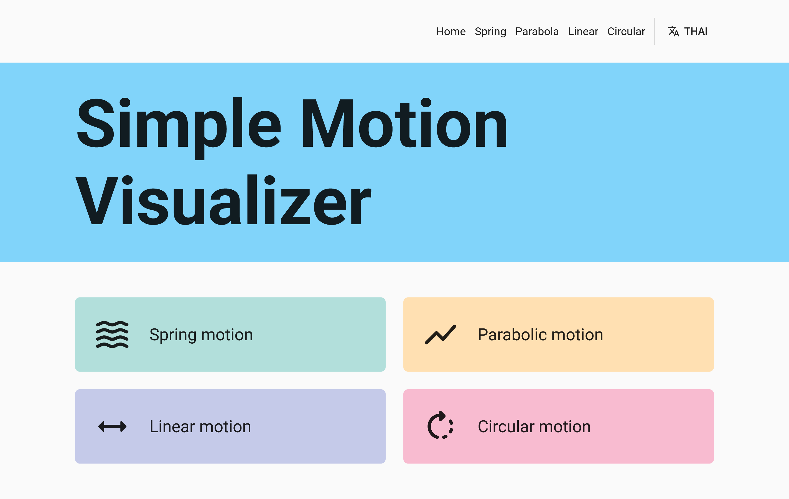
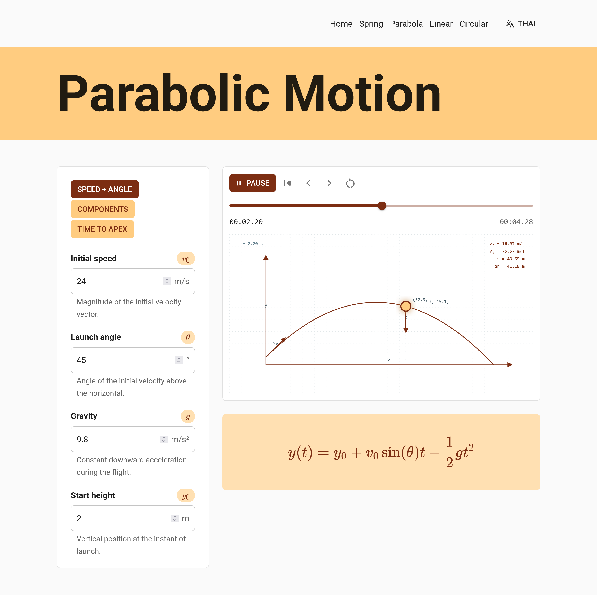
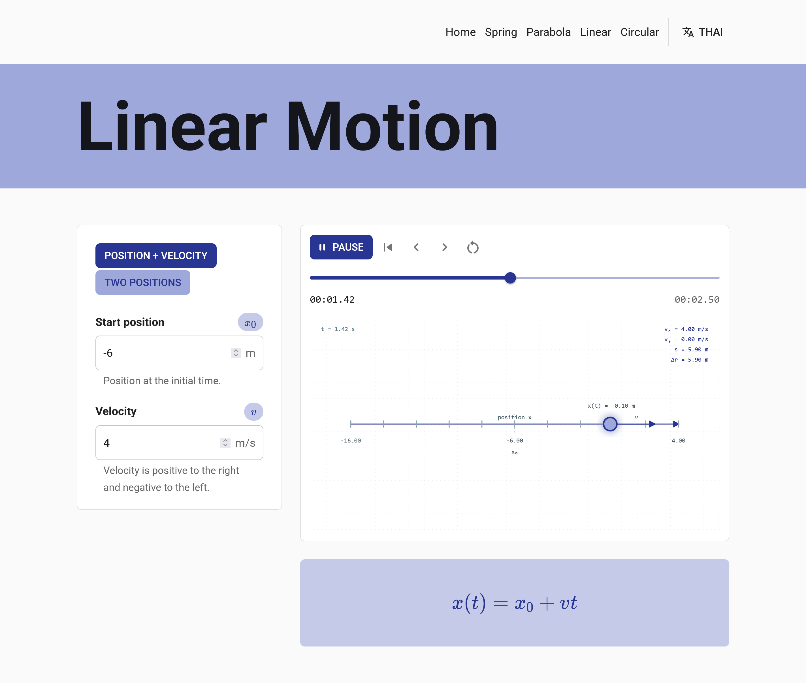
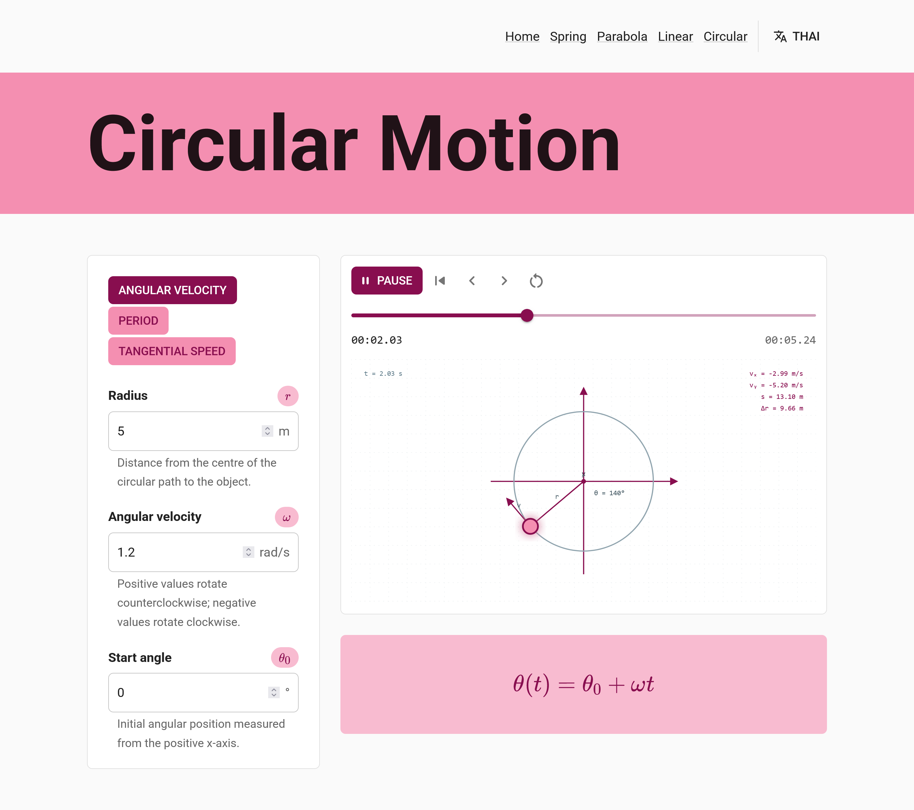

# ~Simple Motion Visualizer

Visualize the four simple motion types in Introduction to Kinematics; projectile or parabolic motion, linear motion, spring/simple harmonic motion, and circular motion.

## ~Projectile / Parabolic Motion

## ~Linear Motion

## ~Spring / Simple Harmonic Motion

## ~Ciruclar Motion

